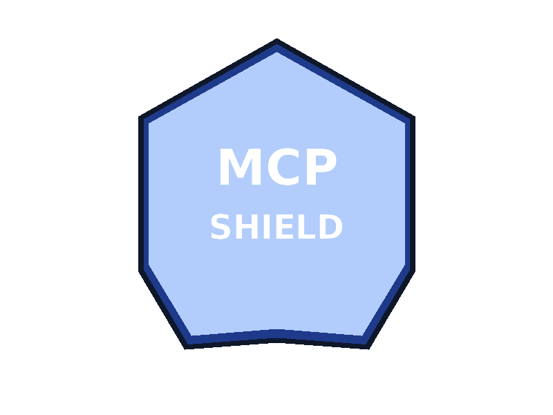
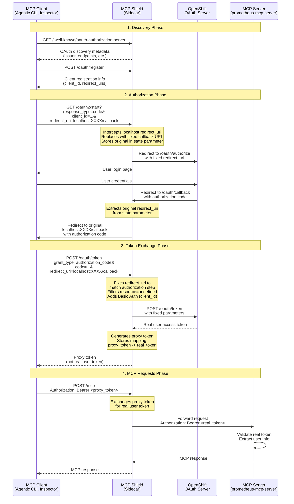

# MCP Shield

<div align="center">
  
</div>

MCP Shield is an OAuth proxy for MCP servers on OpenShift. It provides OAuth 2.0 discovery, client registration, and token exchange for MCP servers such as [prometheus-mcp-server](https://github.com/tjhop/prometheus-mcp-server) and [loki-mcp](https://github.com/grafana/loki-mcp), with OpenShift-specific handling and a proxy token system for enhanced security.

> **Note**: MCP Shield has been tested with Claude (Anthropic's AI assistant) as an MCP client. The implementation is designed to work with any MCP client that follows the OAuth 2.0 flow with Bearer token authentication.

## Features

- **OAuth Discovery**: Implements `/.well-known/oauth-authorization-server` endpoint for OAuth 2.0 discovery
- **Client Registration**: Implements `/oauth/register` endpoint for static client configuration
- **OAuth Start Flow**: Implements `/oauth2/start` endpoint that redirects to OpenShift OAuth with callback proxy support
- **OAuth Callback**: Implements `/oauth/callback` endpoint that handles OpenShift callbacks and redirects to original client redirect URIs
- **Token Exchange**: Implements `/oauth/token` endpoint with filtering of `resource=undefined` parameter and redirect_uri fixing
- **Proxy Token System**: Generates proxy tokens for clients instead of exposing real user tokens, enhancing security
- **MCP Proxy**: Proxies `/mcp` and root path (`/`) requests to the MCP server backend, exchanging proxy tokens for real tokens
- **CORS Support**: Properly configured CORS headers for browser-based OAuth flows
- **Dynamic Redirect URI Support**: Handles dynamic localhost redirect URIs from MCP clients (e.g., Agentic CLI) via callback proxy mechanism

## Environment Variables

- **`OAUTH_AUTHORIZATION_SERVERS`** (required): Comma-separated list of authorization server URLs (should be the public URL where MCP Shield is accessible)
  - Used to derive gateway URL and callback URLs
  - Example: `https://prometheus-mcp-server.apps.example.com`

- **`INSPECTOR_ORIGIN`** (optional): Origin URL for the MCP Inspector (for CORS headers)
  - Defaults to `*` (allow all origins) if not set
  - Example: `https://mcp-inspector.apps.example.com`

- **`OAUTH_CLIENT_ID`** (optional): OAuth client ID that must match the OAuthClient name in OpenShift
  - Defaults to `prometheus-mcp-server` if not set
  - Must match the `metadata.name` of the OAuthClient resource

- **`OAUTH_REDIRECT_URIS`** (optional): Comma-separated list of additional redirect URIs
  - Default redirect URIs are automatically generated from `OAUTH_AUTHORIZATION_SERVERS` and `INSPECTOR_ORIGIN`
  - Example: `https://custom-redirect.example.com/callback,https://another.example.com/callback`

- **`OPENSHIFT_OAUTH_TOKEN_URL`** (optional): OpenShift OAuth token endpoint URL
  - Auto-derived from `OAUTH_AUTHORIZATION_SERVERS` if not set
  - Format: `https://oauth-openshift.apps.<cluster-domain>/oauth/token`
  - Usually doesn't need to be set manually

- **`MCP_BACKEND_URL`** (optional): URL of the MCP server backend container
  - Defaults to `http://localhost:8080` if not set
  - Used by the MCP proxy to forward requests
  - Example: `http://localhost:8080` (for sidecar in same pod)

- **`MCP_BACKEND_PATH`** (optional): Backend path endpoint to forward requests to
  - Defaults to `/mcp` if not set (for Prometheus MCP server)
  - For Loki MCP server, set to `/stream` (Loki uses `/stream` for HTTP, `/mcp` is for SSE)
  - Example: `MCP_BACKEND_PATH=/stream` (for Loki MCP server)

- **`PROXY_TOKEN_TTL`** (optional): Time-to-live for proxy tokens
  - Defaults to `24h` if not set
  - Format: Go duration string (e.g., `24h`, `12h`, `1h30m`)
  - Proxy tokens expire after this duration and must be refreshed
  - Example: `PROXY_TOKEN_TTL=12h`

## Building

### Local Build

```bash
go build ./cmd/mcp-shield
```

### Docker Build

```bash
# Build the image
docker build -t quay.io/<MY_USER>/mcp-shield:dev .

# Or use the Makefile
make docker-build
```

### Push to Registry

```bash
# Push the image
docker push quay.io/<MY_USER>/mcp-shield:dev

# Or use the Makefile
make docker-push
```

## Running

### Local

```bash
./mcp-shield -listen :8080 -log-level info
```

### Docker

```bash
docker run -p 8080:8080 \
  -e OAUTH_AUTHORIZATION_SERVERS=https://your-mcp-server.apps.example.com \
  -e INSPECTOR_ORIGIN=https://mcp-inspector.apps.example.com \
  quay.io/<MY_USER>/mcp-shield:dev
```

## Endpoints

### OAuth Endpoints

- **`GET /.well-known/oauth-authorization-server`** - OAuth 2.0 discovery metadata
  - Returns OAuth authorization server metadata including issuer, endpoints, supported grant types, etc.
  - Used by MCP clients to discover OAuth configuration

- **`GET/POST /oauth/register`** - Client registration endpoint
  - Returns static client configuration (client_id, redirect_uris, etc.)
  - Supports both GET and POST methods
  - Used by MCP Inspector for dynamic client registration

- **`GET /oauth2/start`** - OAuth authorization flow initiation
  - Accepts OAuth authorization request parameters
  - Intercepts dynamic localhost redirect URIs and replaces with fixed callback URL
  - Stores original redirect URI in state parameter
  - Redirects to OpenShift OAuth authorization endpoint

- **`GET /oauth/callback`** - OAuth callback handler
  - Receives authorization code from OpenShift OAuth server
  - Extracts original redirect URI from state parameter
  - Redirects client to original redirect URI with authorization code

- **`POST /oauth/token`** - Token exchange endpoint
  - Accepts authorization code and exchanges for access token
  - Filters out `resource=undefined` parameter (OpenShift rejects it)
  - Fixes redirect_uri to match the authorization step
  - Adds Basic Auth header with client_id (required by OpenShift)
  - Proxies request to OpenShift OAuth token endpoint
  - Returns access token to client

### MCP Proxy Endpoints

- **`POST /mcp`** - MCP protocol endpoint
  - Proxies MCP protocol requests to the MCP server backend
  - Forwards `Authorization` header with Bearer token (Agentic CLI sends token with each request)
  - Forwards all request headers and cookies
  - Returns MCP server response
  - **Note**: The MCP server is stateless - it extracts the token from each request's Authorization header

- **`POST /mcp/`** - MCP protocol endpoint (trailing slash)
  - Same as `/mcp` but with trailing slash support

- **`POST /`** - Root path MCP proxy
  - Handles POST requests to root path (used by some MCP clients like agentic CLI)
  - Forwards to MCP handler
  - Returns 404 for non-POST requests

### Utility Endpoints

- **`GET /healthz`** - Health check endpoint
  - Returns `200 OK` with body `ok`
  - Used for liveness and readiness probes

## Usage

### Deploying as a Sidecar with Prometheus MCP Server

MCP Shield is designed to run as a sidecar container alongside your MCP server. An example deployment is provided in `examples/openshift-prometheus-sidecar.yml`.

#### Quick Start (Automated)

The easiest way to deploy is using the provided script:

```bash
cd examples
./deploy-openshift-prometheus-sidecar.sh
```

This script will:
1. Detect your OpenShift cluster domain
2. Replace placeholders in the YAML
3. Create the OAuthClient
4. Deploy the application
5. Create a Route (optional)
6. Update environment variables

**Options:**
```bash
# Deploy to a specific namespace
./deploy-openshift-prometheus-sidecar.sh --namespace mcp

# Use a custom OAuth client ID
./deploy-openshift-prometheus-sidecar.sh --client-id my-mcp-server

# Deploy without creating a Route
./deploy-openshift-prometheus-sidecar.sh --no-route

# Clean up deployment
./deploy-openshift-prometheus-sidecar.sh --cleanup
```

#### Manual Deployment

If you prefer to deploy manually, follow these steps:

##### Step 1: Get Your OpenShift Cluster Domain

First, determine your OpenShift cluster domain:

```bash
# Get the cluster domain from the console route
oc get route console -n openshift-console -o jsonpath='{.spec.host}' | sed 's/console-openshift-console\.//' | sed 's/^apps\.//'

# Or from ingress config
oc get ingress.config cluster -o jsonpath='{.spec.domain}' | sed 's/^apps\.//'
```

##### Step 2: Update the Example Deployment

Edit `examples/openshift-prometheus-sidecar.yml` and replace `PLACEHOLDER` with your cluster domain:

```bash
# Replace PLACEHOLDER with your cluster domain
sed -i 's/PLACEHOLDER/your-cluster-domain.com/g' examples/openshift-prometheus-sidecar.yml
```

Also configure environment variables in the MCP Shield container:
- `OAUTH_AUTHORIZATION_SERVERS` - Set to the public URL where MCP Shield is accessible
- `INSPECTOR_ORIGIN` - Set to the MCP Inspector origin URL (for CORS)
- `OAUTH_CLIENT_ID` - Set to match the OAuthClient name you'll create (default: `prometheus-mcp-server`)
- `OAUTH_REDIRECT_URIS` - Optional: comma-separated list of additional redirect URIs
- `MCP_BACKEND_PATH` - Optional: Backend endpoint path (defaults to `/mcp` for Prometheus MCP server)

**Note**: The `openshift-api-url` and `oauth-redirect-uri` in the ConfigMap are for the prometheus-mcp-server configuration, not MCP Shield. MCP Shield uses environment variables instead.

##### Step 3: Create the OAuth Client

Create an OAuthClient in OpenShift that matches your deployment:

```bash
oc create -f - <<EOF
apiVersion: oauth.openshift.io/v1
kind: OAuthClient
metadata:
  name: prometheus-mcp-server
grantMethod: auto
redirectURIs:
  - "https://prometheus-mcp-server.default.svc:8081/oauth/callback"
  - "https://prometheus-mcp-server.apps.<YOUR_CLUSTER_DOMAIN>/oauth/callback"
  - "http://localhost:*/callback"  # For MCP clients like Claude CLI (if supported)
EOF
```

**Note**: 
- Replace `<YOUR_CLUSTER_DOMAIN>` with your actual cluster domain. The redirect URIs should match where your service is accessible.
- **For MCP clients (agentic CLI clients, etc.)**: These clients use dynamic localhost ports (e.g., `http://localhost:49646/callback`). OpenShift OAuthClient doesn't support wildcards in redirect URIs. You have two options:
  1. **Add specific localhost ports** to the `redirectURIs` list (not practical for dynamic ports)
  2. **Use the gateway callback URL** instead: Configure your MCP client to use `https://prometheus-mcp-server.apps.<YOUR_CLUSTER_DOMAIN>/oauth/callback` as the redirect URI

##### Step 4: Deploy the Application

Apply the deployment:

```bash
oc apply -f examples/openshift-prometheus-sidecar.yml
```

##### Step 5: Expose the Service (Optional)

If you want to access the service from outside the cluster, create a Route:

```bash
oc create route edge prometheus-mcp-server \
  --service=prometheus-mcp-server \
  --port=oauth \
  --hostname=prometheus-mcp-server.apps.<YOUR_CLUSTER_DOMAIN>
```

##### Step 6: Update Environment Variables

After creating the Route, update the `OAUTH_AUTHORIZATION_SERVERS` environment variable in the deployment to use the Route URL:

```bash
oc set env deployment/prometheus-mcp-server \
  -c mcp-shield \
  OAUTH_AUTHORIZATION_SERVERS="https://prometheus-mcp-server.apps.<YOUR_CLUSTER_DOMAIN>"
```

#### How It Works

1. **Main Container** (`prometheus-mcp-server`): Runs your MCP server on port 8080
   - Handles MCP protocol requests
   - **Stateless operation**: Extracts Bearer token from `Authorization` header on each request
   - Creates Prometheus client with user's token for each request
   - Queries Prometheus/Thanos using user credentials from the token
   - No session management - each request is independent

2. **MCP Shield Sidecar** (`mcp-shield`): Runs on port 8081 and handles:
   - OAuth discovery endpoints (`/.well-known/oauth-authorization-server`)
   - Client registration (`/oauth/register`)
   - OAuth start flow (`/oauth2/start`) with callback proxy support
   - OAuth callback (`/oauth/callback`) with redirect URI restoration
   - Token exchange (`/oauth/token`) with parameter filtering
   - MCP proxy (`/mcp`, `/mcp/`, `/`) forwarding to MCP server's configured endpoint (`/mcp` by default)

3. **Service**: Exposes both ports:
   - Port 8081 (oauth) - For OAuth endpoints and MCP client connections
   - Port 8080 (mcp) - For direct MCP server access (optional, usually not exposed externally)

4. **Route** (optional): Exposes the service externally via OpenShift Route
   - Typically exposes port 8081 (MCP Shield)
   - Handles TLS termination
   - Provides public URL for OAuth flows

#### Testing

Test the OAuth discovery endpoint:

```bash
# Get the service URL
SERVICE_URL=$(oc get route prometheus-mcp-server -o jsonpath='{.spec.host}')

# Test OAuth discovery
curl https://${SERVICE_URL}/.well-known/oauth-authorization-server
```

Test the health check:

```bash
curl https://${SERVICE_URL}/healthz
```

### Deploying as a Sidecar with Loki MCP Server

MCP Shield can also be deployed alongside the [Grafana Loki MCP Server](https://github.com/grafana/loki-mcp). An example deployment is provided in `examples/openshift-loki-sidecar.yml`.

#### Quick Start (Automated)

The easiest way to deploy is using the provided script:

```bash
cd examples
./deploy-openshift-loki-sidecar.sh
```

This script will:
1. Detect your OpenShift cluster domain
2. Replace placeholders in the YAML
3. Create the OAuthClient
4. Deploy the application
5. Create a Route (optional)
6. Update environment variables

**Options:**
```bash
# Deploy to a specific namespace
./deploy-openshift-loki-sidecar.sh --namespace mcp

# Use a custom OAuth client ID
./deploy-openshift-loki-sidecar.sh --client-id my-loki-mcp-server

# Deploy without creating a Route
./deploy-openshift-loki-sidecar.sh --no-route

# Clean up deployment
./deploy-openshift-loki-sidecar.sh --cleanup
```

#### Manual Deployment

If you prefer to deploy manually, follow these steps:

##### Step 1: Get Your OpenShift Cluster Domain

First, determine your OpenShift cluster domain:

```bash
# Get the cluster domain from the console route
oc get route console -n openshift-console -o jsonpath='{.spec.host}' | sed 's/console-openshift-console\.//' | sed 's/^apps\.//'

# Or from ingress config
oc get ingress.config cluster -o jsonpath='{.spec.domain}' | sed 's/^apps\.//'
```

##### Step 2: Update the Example Deployment

Edit `examples/openshift-loki-sidecar.yml` and replace `PLACEHOLDER` with your cluster domain:

```bash
# Replace PLACEHOLDER with your cluster domain
sed -i 's/PLACEHOLDER/your-cluster-domain.com/g' examples/openshift-loki-sidecar.yml
```

Also configure environment variables:
- **LOKI_URL**: Set to your Loki server URL (e.g., `https://loki-gateway.logging.svc:8080`)
- **LOKI_ORG_ID**: Optional, set if using multi-tenant Loki
- **LOKI_USERNAME/LOKI_PASSWORD**: Optional, for basic auth (if not using OAuth tokens)
- **LOKI_TOKEN**: Leave empty - MCP Shield will inject OAuth tokens via Authorization header

For the MCP Shield container, configure:
- `MCP_BACKEND_PATH` - **Important**: Set to `/stream` for Loki MCP server (Loki uses `/stream` for HTTP requests, `/mcp` is for SSE)
- `OAUTH_AUTHORIZATION_SERVERS` - Set to the public URL where MCP Shield is accessible
- `INSPECTOR_ORIGIN` - Set to the MCP Inspector origin URL (for CORS)
- `OAUTH_CLIENT_ID` - Set to match the OAuthClient name you'll create (default: `loki-mcp-server`)

##### Step 3: Create the OAuth Client

Create an OAuthClient in OpenShift that matches your deployment:

```bash
oc create -f - <<EOF
apiVersion: oauth.openshift.io/v1
kind: OAuthClient
metadata:
  name: loki-mcp-server
grantMethod: auto
redirectURIs:
  - "https://loki-mcp-server.default.svc:8081/oauth/callback"
  - "https://loki-mcp-server.apps.<YOUR_CLUSTER_DOMAIN>/oauth/callback"
EOF
```

**Note**: Replace `<YOUR_CLUSTER_DOMAIN>` with your actual cluster domain.

##### Step 4: Deploy the Application

Apply the deployment:

```bash
oc apply -f examples/openshift-loki-sidecar.yml
```

##### Step 5: Configure Loki URL

Update the `LOKI_URL` environment variable to point to your Loki instance:

```bash
oc set env deployment/loki-mcp-server \
  -c loki-mcp-server \
  LOKI_URL="https://loki-gateway.logging.svc:8080"
```

##### Step 6: Expose the Service (Optional)

If you want to access the service from outside the cluster, create a Route:

```bash
oc create route edge loki-mcp-server \
  --service=loki-mcp-server \
  --port=oauth \
  --hostname=loki-mcp-server.apps.<YOUR_CLUSTER_DOMAIN>
```

##### Step 7: Update Environment Variables

After creating the Route, update the `OAUTH_AUTHORIZATION_SERVERS` environment variable in the deployment to use the Route URL:

```bash
oc set env deployment/loki-mcp-server \
  -c mcp-shield \
  OAUTH_AUTHORIZATION_SERVERS="https://loki-mcp-server.apps.<YOUR_CLUSTER_DOMAIN>"
```

#### How It Works

1. **Main Container** (`loki-mcp-server`): Runs the Loki MCP server on port 8080
   - Handles MCP protocol requests
   - **Stateless operation**: Extracts Bearer token from `Authorization` header on each request
   - Uses the token to authenticate with Loki for each request
   - Queries Loki using user credentials from the token
   - No session management - each request is independent
   - Exposes `/stream` endpoint for HTTP requests (Streamable HTTP)
   - Exposes `/mcp` endpoint for SSE (Server-Sent Events)

2. **MCP Shield Sidecar** (`mcp-shield`): Runs on port 8081 and handles:
   - OAuth discovery endpoints (`/.well-known/oauth-authorization-server`)
   - Client registration (`/oauth/register`)
   - OAuth start flow (`/oauth2/start`) with callback proxy support
   - OAuth callback (`/oauth/callback`) with redirect URI restoration
   - Token exchange (`/oauth/token`) with parameter filtering
   - MCP proxy (`/mcp`, `/mcp/`, `/`) forwarding to Loki MCP server's `/stream` endpoint
   - **sessionId injection**: Automatically injects `sessionId` into JSON-RPC requests (required by Loki MCP server)

3. **Service**: Exposes both ports:
   - Port 8081 (oauth) - For OAuth endpoints and MCP client connections
   - Port 8080 (mcp) - For direct MCP server access (optional, usually not exposed externally)

4. **Route** (optional): Exposes the service externally via OpenShift Route
   - Typically exposes port 8081 (MCP Shield)
   - Handles TLS termination
   - Provides public URL for OAuth flows

#### Testing

Test the OAuth discovery endpoint:

```bash
# Get the service URL
SERVICE_URL=$(oc get route loki-mcp-server -o jsonpath='{.spec.host}')

# Test OAuth discovery
curl https://${SERVICE_URL}/.well-known/oauth-authorization-server
```

Test the health check:

```bash
curl https://${SERVICE_URL}/healthz
```

### MCP Server Endpoint Differences

Different MCP servers use different endpoint paths for HTTP requests:

- **Prometheus MCP Server**: Uses `/mcp` endpoint for HTTP requests
  - Configure: `MCP_BACKEND_PATH=/mcp` (this is the default)
  
- **Loki MCP Server**: Uses `/stream` endpoint for HTTP requests
  - Configure: `MCP_BACKEND_PATH=/stream`
  - Note: Loki's `/mcp` endpoint is for SSE (Server-Sent Events), not HTTP POST requests
  - Also requires `sessionId` injection in JSON-RPC requests (handled automatically by MCP Shield)

The `MCP_BACKEND_PATH` environment variable allows you to configure the correct endpoint for your MCP server type.

### Local Development

For local development and testing:

```bash
# Build the binary
go build ./cmd/mcp-shield

# Run with environment variables
export OAUTH_AUTHORIZATION_SERVERS="https://your-mcp-server.apps.example.com"
export INSPECTOR_ORIGIN="https://mcp-inspector.apps.example.com"
./mcp-shield -listen :8080 -log-level debug
```

## Architecture

MCP Shield is designed to run as a sidecar service alongside the MCP server, handling OAuth-related endpoints that require special handling for OpenShift integration.

### OAuth Flow Diagram

The following diagram illustrates the complete OAuth authentication flow:



### Flow Steps Explained

1. **Discovery Phase**:
   - Client requests OAuth discovery metadata to learn available endpoints
   - Client registers itself (or receives static client configuration)

2. **Authorization Phase**:
   - Client initiates OAuth flow with a dynamic localhost redirect URI
   - MCP Shield intercepts and replaces it with a fixed callback URL
   - User authenticates with OpenShift
   - OpenShift redirects to the fixed callback URL
   - MCP Shield extracts the original redirect URI from the state parameter and redirects the client

3. **Token Exchange Phase**:
   - Client exchanges authorization code for access token
   - MCP Shield fixes the redirect_uri to match the authorization step
   - MCP Shield filters out `resource=undefined` parameter (OpenShift rejects it)
   - MCP Shield adds Basic Auth with client_id (required by OpenShift)
   - MCP Shield receives real user token from OpenShift
   - **MCP Shield generates a proxy token** and stores the mapping (proxy_token -> real_token)
   - **Client receives proxy token** (not the real user token)
   - Proxy token is only valid for use with this MCP Shield instance

4. **MCP Requests Phase**:
   - **Agentic CLI clients cache the proxy token locally** (client-side) after receiving it
   - Client makes MCP requests with proxy token in `Authorization: Bearer <proxy_token>` header
   - **MCP Shield exchanges proxy token for real user token** before forwarding to MCP server
   - MCP Shield forwards requests with real user token in `Authorization` header to MCP server
   - **MCP server is stateless** - it extracts the Bearer token from each request's Authorization header
   - MCP server uses the real token to authenticate with Prometheus/Thanos on behalf of the user
   - **Security benefit**: Agentic CLI clients never have access to the real user token - they can only use the proxy token with this MCP Shield instance
   - No server-side sessions are maintained - each request is independent

### Proxy Token Security Model

The proxy token system provides an important security layer:

**Problem**: Without proxy tokens, agentic CLI clients would cache the real OpenShift OAuth token, which could be:
- Used to access any OpenShift resource the user has permissions for
- Extracted from the client's cache and used maliciously
- A security risk if the client is compromised

**Solution**: MCP Shield generates proxy tokens that:
- ✅ **Cannot be used outside MCP Shield**: Proxy tokens are only valid for this specific MCP Shield instance
- ✅ **Scoped to MCP access**: Proxy tokens can only be exchanged for real tokens when making MCP requests through MCP Shield
- ✅ **Time-limited**: Proxy tokens expire after a configurable TTL (default: 24 hours)
- ✅ **No direct OpenShift access**: Even if a proxy token is compromised, it cannot be used to directly access OpenShift resources - it must go through MCP Shield

**How it works**:
1. User authenticates with OpenShift OAuth
2. MCP Shield receives the real user token from OpenShift
3. MCP Shield generates a secure random proxy token
4. MCP Shield stores the mapping: `proxy_token -> real_token` (in-memory, not persisted)
5. Agentic CLI clients receive and cache the proxy token
6. When agentic CLI clients make MCP requests, MCP Shield exchanges the proxy token for the real token
7. Real token is only used server-side and never exposed to the client

## Why Not Use the Official OpenShift oauth-proxy?

You might wonder why we don't use the [official OpenShift oauth-proxy](https://github.com/openshift/oauth-proxy) project. Here's why:

The official `oauth-proxy` is a **reverse proxy** designed to:
- Authenticate users via OpenShift OAuth
- Proxy authenticated requests to upstream services
- Manage session cookies and authentication state

However, **MCP clients** (like the MCP Inspector) have different requirements:

### Authentication Method: Bearer Tokens vs Cookies

- **Official oauth-proxy**: Uses **cookie-based sessions** - it sets cookies after authentication and validates them on subsequent requests. The server maintains session state.
- **MCP clients**: Use **Bearer tokens** in the `Authorization` header - they perform the OAuth flow themselves, cache the access token locally (client-side), and send it with each request. The server is stateless.

**How agentic CLI clients handle authentication with MCP Shield:**
1. The agentic CLI client completes the OAuth flow and receives a **proxy token** (not the real user token)
2. **The agentic CLI client caches the proxy token locally** (in its local storage/cache)
3. The agentic CLI client sends the proxy token in the `Authorization: Bearer <proxy_token>` header with each MCP request
4. **MCP Shield exchanges the proxy token for the real user token** before forwarding to the MCP server
5. The MCP server receives the real token and uses it to authenticate with Prometheus
6. **No server-side sessions** - the MCP server is stateless and processes each request independently
7. **Security benefit**: Agentic CLI clients never have access to the real user token - only the proxy token, which is only valid for this MCP Shield instance

MCP clients need to:
1. Discover OAuth endpoints via `/.well-known/oauth-authorization-server`
2. Register as an OAuth client via `/oauth/register`
3. Initiate OAuth flow via `/oauth2/start`
4. Exchange authorization codes for tokens via `/oauth/token` (receives proxy token)
5. Cache the proxy token locally and send it with each subsequent MCP request
6. MCP Shield handles the exchange of proxy token → real token transparently

### Missing OAuth Discovery Endpoints

The official oauth-proxy doesn't provide the OAuth 2.0 discovery endpoints that MCP clients require:

1. **OAuth Discovery** (`/.well-known/oauth-authorization-server`) - MCP clients need this to discover OAuth endpoints
2. **Client Registration** (`/oauth/register`) - MCP Inspector performs dynamic client registration
3. **OAuth Start Flow** (`/oauth2/start`) - Needs to redirect to OpenShift OAuth with proper parameters and handle dynamic localhost redirect URIs
4. **OAuth Callback** (`/oauth/callback`) - Needs to handle OpenShift callbacks and restore original client redirect URIs
5. **Token Exchange** (`/oauth/token`) - Requires:
   - Filtering of `resource=undefined` parameter that OpenShift rejects
   - Fixing redirect URIs to match authorization step
   - Adding Basic Auth headers required by OpenShift
   - **Generating proxy tokens** instead of returning real user tokens

### MCP Shield Solution

MCP Shield is specifically designed to:
- ✅ Provide OAuth 2.0 discovery endpoints that MCP clients expect
- ✅ Handle OpenShift-specific OAuth flows (PKCE, token exchange)
- ✅ Support Bearer token authentication (not cookie-based)
- ✅ **Proxy token system**: Generate proxy tokens for clients instead of exposing real user tokens
  - Clients receive proxy tokens that are only valid for this MCP Shield instance
  - Real user tokens are never exposed to clients
  - Proxy tokens are time-limited (configurable TTL, default: 24 hours)
  - Enhanced security: even if a proxy token is compromised, it cannot be used to directly access OpenShift resources
- ✅ **Token exchange**: Exchange proxy tokens for real tokens when forwarding MCP requests
  - Transparent exchange happens server-side before forwarding to MCP server
  - Real tokens are only used server-side and never exposed to clients
- ✅ Handle dynamic localhost redirect URIs via callback proxy mechanism
  - Intercepts dynamic `localhost:XXXX/callback` redirect URIs
  - Uses fixed callback URL for OpenShift OAuth
  - Restores original redirect URI after authentication
- ✅ Filter problematic parameters (`resource=undefined`) that OpenShift rejects
- ✅ Fix redirect URIs in token exchange to match authorization step
- ✅ Add required Basic Auth headers for OpenShift OAuth token endpoint
- ✅ Proxy MCP protocol requests to the backend MCP server
  - Handles `/mcp`, `/mcp/`, and root path (`/`) requests
  - Exchanges proxy tokens for real tokens before forwarding
- ✅ CORS support for browser-based OAuth flows (MCP Inspector)
- ✅ Work seamlessly with MCP Inspector, agentic CLI clients, and other MCP clients
- ✅ Run as a lightweight sidecar without proxying all traffic
- ✅ Stateless operation - no server-side session management

**In summary**: The official oauth-proxy is designed for browser-based cookie authentication, while MCP clients need programmatic OAuth with Bearer tokens. This project fills that gap by providing:
1. The OAuth discovery and token exchange endpoints that MCP requires
2. A proxy token system that enhances security by preventing clients from accessing real user tokens
3. OpenShift-specific OAuth flow handling (PKCE, parameter filtering, redirect URI management)
4. Support for dynamic localhost redirect URIs used by MCP clients like agentic CLI clients

## Why Not Use mcp-gateway?

You might also wonder why we don't use [mcp-gateway](https://github.com/kagenti/mcp-gateway), which is an Envoy-based MCP Gateway that also provides OAuth support. Here's why:

### Architecture Differences

- **mcp-gateway**: A full gateway infrastructure component built on Envoy and Gateway API
  - Requires Istio, Gateway API CRDs, and a controller
  - Acts as a centralized gateway for multiple MCP servers
  - More complex deployment with multiple components (broker, router, controller)
  - Designed for multi-tenant, multi-server scenarios

- **MCP Shield**: A lightweight sidecar designed for single MCP server deployments
  - Runs alongside your MCP server in the same pod
  - No external dependencies (no Istio, Gateway API, or controller required)
  - Simple deployment - just add as a sidecar container
  - Designed for direct integration with a single MCP server

### OAuth Implementation Differences

**mcp-gateway's OAuth support:**
- Provides OAuth Protected Resource discovery (`/.well-known/oauth-protected-resource`)
- Focuses on token validation and authorization
- Assumes OAuth flow is handled elsewhere
- Does not implement the complete OAuth 2.0 flow endpoints that MCP clients need

**MCP Shield's OAuth support:**
- ✅ Implements **complete OAuth 2.0 flow** for MCP clients:
  - OAuth discovery (`/.well-known/oauth-authorization-server`)
  - Client registration (`/oauth/register`)
  - OAuth start flow (`/oauth2/start`) with dynamic redirect URI handling
  - OAuth callback (`/oauth/callback`) with redirect URI restoration
  - Token exchange (`/oauth/token`) with OpenShift-specific handling
- ✅ **Proxy token system** for enhanced security
- ✅ **OpenShift-specific handling**: PKCE, parameter filtering, redirect URI fixing
- ✅ **Dynamic localhost redirect URI support** for agentic CLI clients and similar MCP clients

### Use Case Differences

**Use mcp-gateway when:**
- You need to aggregate multiple MCP servers
- You want a centralized gateway infrastructure
- You're already using Istio and Gateway API
- You have a separate OAuth infrastructure and just need token validation
- You need advanced routing and load balancing across multiple MCP servers

**Use MCP Shield when:**
- You have a single MCP server (like prometheus-mcp-server)
- You want a simple sidecar deployment without external dependencies
- You need complete OAuth flow handling for MCP clients
- You're deploying to OpenShift and need OpenShift-specific OAuth handling
- You want proxy tokens for enhanced security
- You need support for dynamic localhost redirect URIs (agentic CLI clients)

### Summary

mcp-gateway is a powerful solution for multi-server MCP deployments with existing OAuth infrastructure, while MCP Shield is designed for single-server deployments that need complete OAuth flow handling, especially for OpenShift environments. If you're running a single MCP server (like prometheus-mcp-server) and need full OAuth support for MCP clients, MCP Shield provides a simpler, more focused solution.

