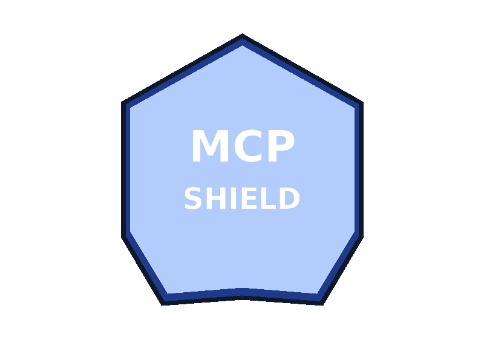
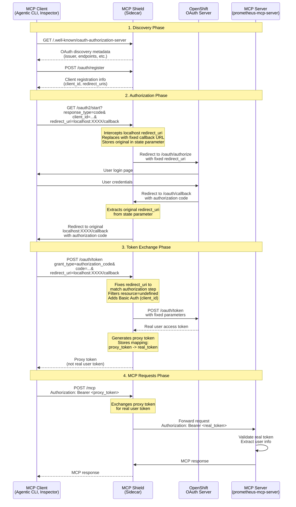

# MCP Shield

<div align="center">
  
</div>

MCP Shield is an OAuth proxy for MCP servers on OpenShift. It provides OAuth 2.0 discovery, client registration, and token exchange for MCP servers with OpenShift-specific handling and a proxy token system for enhanced security.

Supported MCP servers:
- [prometheus-mcp-server](https://github.com/tjhop/prometheus-mcp-server)
- [loki-mcp](https://github.com/grafana/loki-mcp)
- [kubernetes-mcp-server](https://github.com/containers/kubernetes-mcp-server)
- [mcp-gateway](https://github.com/kagenti/mcp-gateway)

> **Note**: MCP Shield has been tested with Claude (Anthropic's AI assistant) as an MCP client. The implementation is designed to work with any MCP client that follows the OAuth 2.0 flow with Bearer token authentication.

## Features

- **OAuth Discovery**: Implements `/.well-known/oauth-authorization-server` endpoint for OAuth 2.0 discovery
- **Client Registration**: Implements `/oauth/register` endpoint for static client configuration
- **OAuth Start Flow**: Implements `/oauth2/start` endpoint that redirects to OpenShift OAuth with callback proxy support
- **OAuth Callback**: Implements `/oauth/callback` endpoint that handles OpenShift callbacks and redirects to original client redirect URIs
- **Token Exchange**: Implements `/oauth/token` endpoint with filtering of `resource=undefined` parameter and redirect_uri fixing
- **Proxy Token System**: Generates proxy tokens for clients instead of exposing real user tokens, enhancing security
- **MCP Proxy**: Proxies `/mcp` and root path (`/`) requests to the MCP server backend, exchanging proxy tokens for real tokens
- **CORS Support**: Properly configured CORS headers for browser-based OAuth flows
- **Dynamic Redirect URI Support**: Handles dynamic localhost redirect URIs from MCP clients (e.g., Agentic CLI) via callback proxy mechanism

## Environment Variables

- **`OAUTH_AUTHORIZATION_SERVERS`** (required): Comma-separated list of authorization server URLs (should be the public URL where MCP Shield is accessible)
  - Used to derive gateway URL and callback URLs
  - Example: `https://prometheus-mcp-server.apps.example.com`

- **`INSPECTOR_ORIGIN`** (optional): Origin URL for the MCP Inspector (for CORS headers)
  - Defaults to `*` (allow all origins) if not set
  - Example: `https://mcp-inspector.apps.example.com`

- **`OAUTH_CLIENT_ID`** (optional): OAuth client ID that must match the OAuthClient name in OpenShift
  - Defaults to `prometheus-mcp-server` if not set
  - Must match the `metadata.name` of the OAuthClient resource

- **`OAUTH_REDIRECT_URIS`** (optional): Comma-separated list of additional redirect URIs
  - Default redirect URIs are automatically generated from `OAUTH_AUTHORIZATION_SERVERS` and `INSPECTOR_ORIGIN`
  - Example: `https://custom-redirect.example.com/callback,https://another.example.com/callback`

- **`OPENSHIFT_OAUTH_TOKEN_URL`** (optional): OpenShift OAuth token endpoint URL
  - Auto-derived from `OAUTH_AUTHORIZATION_SERVERS` if not set
  - Format: `https://oauth-openshift.apps.<cluster-domain>/oauth/token`
  - Usually doesn't need to be set manually

- **`MCP_BACKEND_URL`** (optional): URL of the MCP server backend container
  - Defaults to `http://localhost:8080` if not set
  - **Automatic Gateway Detection**: MCP Shield automatically detects if this points to an mcp-gateway instance by calling its `/status` endpoint
  - **If detected as a gateway**: MCP Shield automatically discovers upstream servers and routes tool calls directly to them. Session management is handled automatically via `initialize` calls with session IDs in both JSON body and HTTP header (`mcp-session-id`)
  - **If NOT detected as a gateway**: MCP Shield uses it as a regular fallback for all MCP requests (including tool calls). No direct routing is attempted, and requests are forwarded to the backend as-is
  - Example: `http://localhost:8080` (for sidecar in same pod) or `http://mcp-gateway:8080` (for gateway discovery)
  - See [Direct Tool Routing](./docs/direct-tool-routing.md) for details
  - To send **all** MCP traffic through the gateway (no direct upstream `tools/call`), set `MCP_SHIELD_DIRECT_TOOL_ROUTING=false` — see [MCP Gateway integration](./docs/mcp-gateway-integration.md)

- **`MCP_SHIELD_DIRECT_TOOL_ROUTING`** (optional): When `false`, `0`, `no`, or `off`, disables mcp-gateway `/status` discovery and sends every MCP request (including `tools/call`) to `MCP_BACKEND_URL` only. Default is on (`true`) for backward compatibility.

- **`MCP_BACKEND_PATH`** (optional): Backend path endpoint to forward requests to
  - Defaults to `/mcp` if not set (for Prometheus MCP server)
  - For Loki MCP server, set to `/stream` (Loki uses `/stream` for HTTP, `/mcp` is for SSE)
  - Example: `MCP_BACKEND_PATH=/stream` (for Loki MCP server)

- **`PROXY_TOKEN_TTL`** (optional): Time-to-live for proxy tokens
  - Defaults to `24h` if not set
  - Format: Go duration string (e.g., `24h`, `12h`, `1h30m`)
  - Proxy tokens expire after this duration and must be refreshed
  - Example: `PROXY_TOKEN_TTL=12h`

## Building

### Local Build

```bash
go build ./cmd/mcp-shield
```

### Docker Build

```bash
# Build the image
docker build -t quay.io/<MY_USER>/mcp-shield:dev .

# Or use the Makefile
make docker-build
```

### Push to Registry

```bash
# Push the image
docker push quay.io/<MY_USER>/mcp-shield:dev

# Or use the Makefile
make docker-push
```

## Testing

```bash
make test       # unit tests (handlers, tokenstore, …)
make test-e2e   # subprocess mcp-shield + httptest fake OpenShift token + MCP backend
```

E2E tests live under `tests/e2e/` and use the build tag `e2e` (`go test -tags=e2e ./tests/e2e/...`). They do not require a real OpenShift cluster.

## Running

### Local

```bash
./mcp-shield -listen :8080 -log-level info
```

### Docker

```bash
docker run -p 8080:8080 \
  -e OAUTH_AUTHORIZATION_SERVERS=https://your-mcp-server.apps.example.com \
  -e INSPECTOR_ORIGIN=https://mcp-inspector.apps.example.com \
  quay.io/<MY_USER>/mcp-shield:dev
```

## Endpoints

### OAuth Endpoints

- **`GET /.well-known/oauth-authorization-server`** - OAuth 2.0 discovery metadata
  - Returns OAuth authorization server metadata including issuer, endpoints, supported grant types, etc.
  - Used by MCP clients to discover OAuth configuration

- **`GET/POST /oauth/register`** - Client registration endpoint
  - Returns static client configuration (client_id, redirect_uris, etc.)
  - Supports both GET and POST methods
  - Used by MCP Inspector for dynamic client registration

- **`GET /oauth2/start`** - OAuth authorization flow initiation
  - Accepts OAuth authorization request parameters
  - Intercepts dynamic localhost redirect URIs and replaces with fixed callback URL
  - Stores original redirect URI in state parameter
  - Redirects to OpenShift OAuth authorization endpoint

- **`GET /oauth/callback`** - OAuth callback handler
  - Receives authorization code from OpenShift OAuth server
  - Extracts original redirect URI from state parameter
  - Redirects client to original redirect URI with authorization code

- **`POST /oauth/token`** - Token exchange endpoint
  - Accepts authorization code and exchanges for access token
  - Filters out `resource=undefined` parameter (OpenShift rejects it)
  - Fixes redirect_uri to match the authorization step
  - Adds Basic Auth header with client_id (required by OpenShift)
  - Proxies request to OpenShift OAuth token endpoint
  - Returns access token to client

### MCP Proxy Endpoints

- **`POST /mcp`** - MCP protocol endpoint
  - Proxies MCP protocol requests to the MCP server backend
  - Forwards `Authorization` header with Bearer token (Agentic CLI sends token with each request)
  - Forwards all request headers and cookies
  - Returns MCP server response
  - **Note**: The MCP server is stateless - it extracts the token from each request's Authorization header

- **`POST /mcp/`** - MCP protocol endpoint (trailing slash)
  - Same as `/mcp` but with trailing slash support

- **`POST /`** - Root path MCP proxy
  - Handles POST requests to root path (used by some MCP clients like agentic CLI)
  - Forwards to MCP handler
  - Returns 404 for non-POST requests

### Utility Endpoints

- **`GET /healthz`** - Health check endpoint
  - Returns `200 OK` with body `ok`
  - Used for liveness and readiness probes

## Usage

**OpenShift (user token → Prometheus / Loki):** see the opinionated checklist and object list in [OpenShift user pattern](./docs/openshift-user-pattern.md) and the indexed [examples/](./examples/README.md).

MCP Shield is designed to run as a sidecar container alongside your MCP server. Detailed deployment guides are available for each supported MCP server:

- **[Prometheus MCP Server](docs/examples/prometheus-mcp-server.md)** - Complete guide for deploying with prometheus-mcp-server
- **[Loki MCP Server](docs/examples/loki-mcp-server.md)** - Complete guide for deploying with loki-mcp-server
- **[Kubernetes MCP Server](docs/examples/kubernetes-mcp-server.md)** - Shield sidecar with `cluster_auth_mode = passthrough` (per-user OpenShift OAuth)
- **[Helm deployment planning](docs/helm-deployment.md)** - When to use examples vs kubernetes-mcp-server chart vs a future Shield chart
- **[MCP Gateway](docs/examples/mcp-gateway.md)** - Complete guide for deploying with mcp-gateway

### MCP Server Endpoint Differences

Different MCP servers use different endpoint paths for HTTP requests:

- **Prometheus MCP Server**: Uses `/mcp` endpoint for HTTP requests
  - Configure: `MCP_BACKEND_PATH=/mcp` (this is the default)
  
- **Loki MCP Server**: Uses `/stream` endpoint for HTTP requests
  - Configure: `MCP_BACKEND_PATH=/stream`
  - Note: Loki's `/mcp` endpoint is for SSE (Server-Sent Events), not HTTP POST requests
  - Also requires `sessionId` injection in JSON-RPC requests (handled automatically by MCP Shield)

- **Kubernetes MCP Server**: Uses `/mcp` endpoint for HTTP requests
  - Configure: `MCP_BACKEND_PATH=/mcp` (this is the default)
  - Note: While kubernetes-mcp-server supports external OAuth (proxying well-known endpoints), it does not implement the complete OAuth flow. MCP Shield provides the full OAuth 2.0 flow implementation.

The `MCP_BACKEND_PATH` environment variable allows you to configure the correct endpoint for your MCP server type.

### Local Development

For local development and testing:

```bash
# Build the binary
go build ./cmd/mcp-shield

# Run with environment variables
export OAUTH_AUTHORIZATION_SERVERS="https://your-mcp-server.apps.example.com"
export INSPECTOR_ORIGIN="https://mcp-inspector.apps.example.com"
./mcp-shield -listen :8080 -log-level debug
```

## Architecture

MCP Shield is designed to run as a sidecar service alongside the MCP server, handling OAuth-related endpoints that require special handling for OpenShift integration.

### OAuth Flow Diagram

The following diagram illustrates the complete OAuth authentication flow:


```mermaid
sequenceDiagram
    participant Client as MCP Client<br/>(Agentic CLI, Inspector)
    participant Proxy as MCP Shield<br/>(Sidecar)
    participant OpenShift as OpenShift<br/>OAuth Server
    participant MCP as MCP Server<br/>(prometheus-mcp-server)

    Note over Client,MCP: 1. Discovery Phase
    Client->>Proxy: GET /.well-known/oauth-authorization-server
    Proxy-->>Client: OAuth discovery metadata<br/>(issuer, endpoints, etc.)

    Client->>Proxy: POST /oauth/register
    Proxy-->>Client: Client registration info<br/>(client_id, redirect_uris)

    Note over Client,MCP: 2. Authorization Phase
    Client->>Proxy: GET /oauth2/start?<br/>response_type=code&<br/>client_id=...&<br/>redirect_uri=localhost:XXXX/callback
    Note over Proxy: Intercepts localhost redirect_uri<br/>Replaces with fixed callback URL<br/>Stores original in state parameter
    Proxy->>OpenShift: Redirect to /oauth/authorize<br/>with fixed redirect_uri
    OpenShift->>Client: User login page
    Client->>OpenShift: User credentials
    OpenShift->>Proxy: Redirect to /oauth/callback<br/>with authorization code
    Note over Proxy: Extracts original redirect_uri<br/>from state parameter
    Proxy->>Client: Redirect to original<br/>localhost:XXXX/callback<br/>with authorization code

    Note over Client,MCP: 3. Token Exchange Phase
    Client->>Proxy: POST /oauth/token<br/>grant_type=authorization_code&<br/>code=...&<br/>redirect_uri=localhost:XXXX/callback
    Note over Proxy: Fixes redirect_uri to<br/>match authorization step<br/>Filters resource=undefined<br/>Adds Basic Auth (client_id)
    Proxy->>OpenShift: POST /oauth/token<br/>with fixed parameters
    OpenShift-->>Proxy: Real user access token
    Note over Proxy: Generates proxy token<br/>Stores mapping:<br/>proxy_token -> real_token
    Proxy-->>Client: Proxy token<br/>(not real user token)

    Note over Client,MCP: 4. MCP Requests Phase
    Client->>Proxy: POST /mcp<br/>Authorization: Bearer <proxy_token>
    Note over Proxy: Exchanges proxy token<br/>for real user token
    Proxy->>MCP: Forward request<br/>Authorization: Bearer <real_token>
    MCP->>MCP: Validate real token<br/>Extract user info
    MCP->>Proxy: MCP response
    Proxy-->>Client: MCP response
```

### Flow Steps Explained

1. **Discovery Phase**:
   - Client requests OAuth discovery metadata to learn available endpoints
   - Client registers itself (or receives static client configuration)

2. **Authorization Phase**:
   - Client initiates OAuth flow with a dynamic localhost redirect URI
   - MCP Shield intercepts and replaces it with a fixed callback URL
   - User authenticates with OpenShift
   - OpenShift redirects to the fixed callback URL
   - MCP Shield extracts the original redirect URI from the state parameter and redirects the client

3. **Token Exchange Phase**:
   - Client exchanges authorization code for access token
   - MCP Shield fixes the redirect_uri to match the authorization step
   - MCP Shield filters out `resource=undefined` parameter (OpenShift rejects it)
   - MCP Shield adds Basic Auth with client_id (required by OpenShift)
   - MCP Shield receives real user token from OpenShift
   - **MCP Shield generates a proxy token** and stores the mapping (proxy_token -> real_token)
   - **Client receives proxy token** (not the real user token)
   - Proxy token is only valid for use with this MCP Shield instance

4. **MCP Requests Phase**:
   - **Agentic CLI clients cache the proxy token locally** (client-side) after receiving it
   - Client makes MCP requests with proxy token in `Authorization: Bearer <proxy_token>` header
   - **MCP Shield exchanges proxy token for real user token** before forwarding to MCP server
   - MCP Shield forwards requests with real user token in `Authorization` header to MCP server
   - **MCP server is stateless** - it extracts the Bearer token from each request's Authorization header
   - MCP server uses the real token to authenticate with Prometheus/Thanos on behalf of the user
   - **Security benefit**: Agentic CLI clients never have access to the real user token - they can only use the proxy token with this MCP Shield instance
   - No server-side sessions are maintained - each request is independent

### Proxy Token Security Model

The proxy token system provides an important security layer:

**Problem**: Without proxy tokens, agentic CLI clients would cache the real OpenShift OAuth token, which could be:
- Used to access any OpenShift resource the user has permissions for
- Extracted from the client's cache and used maliciously
- A security risk if the client is compromised

**Solution**: MCP Shield generates proxy tokens that:
- ✅ **Cannot be used outside MCP Shield**: Proxy tokens are only valid for this specific MCP Shield instance
- ✅ **Scoped to MCP access**: Proxy tokens can only be exchanged for real tokens when making MCP requests through MCP Shield
- ✅ **Time-limited**: Proxy tokens expire after a configurable TTL (default: 24 hours)
- ✅ **No direct OpenShift access**: Even if a proxy token is compromised, it cannot be used to directly access OpenShift resources - it must go through MCP Shield

**How it works**:
1. User authenticates with OpenShift OAuth
2. MCP Shield receives the real user token from OpenShift
3. MCP Shield generates a secure random proxy token
4. MCP Shield stores the mapping: `proxy_token -> real_token` (in-memory, not persisted)
5. Agentic CLI clients receive and cache the proxy token
6. When agentic CLI clients make MCP requests, MCP Shield exchanges the proxy token for the real token
7. Real token is only used server-side and never exposed to the client

## Comparisons and gateway notes

For mcp-gateway placement, direct vs through-gateway routing, and [Kuadrant/mcp-gateway#414](https://github.com/Kuadrant/mcp-gateway/issues/414), see [MCP Gateway integration](./docs/mcp-gateway-integration.md).

For detailed comparisons with alternative solutions, see [Comparisons](docs/comparisons.md), which covers:
- **Why not use the official OpenShift oauth-proxy?** - Differences in authentication methods, OAuth discovery endpoints, and use cases
- **Why not use mcp-gateway?** - Architecture differences, OAuth implementation differences, and use case guidance

